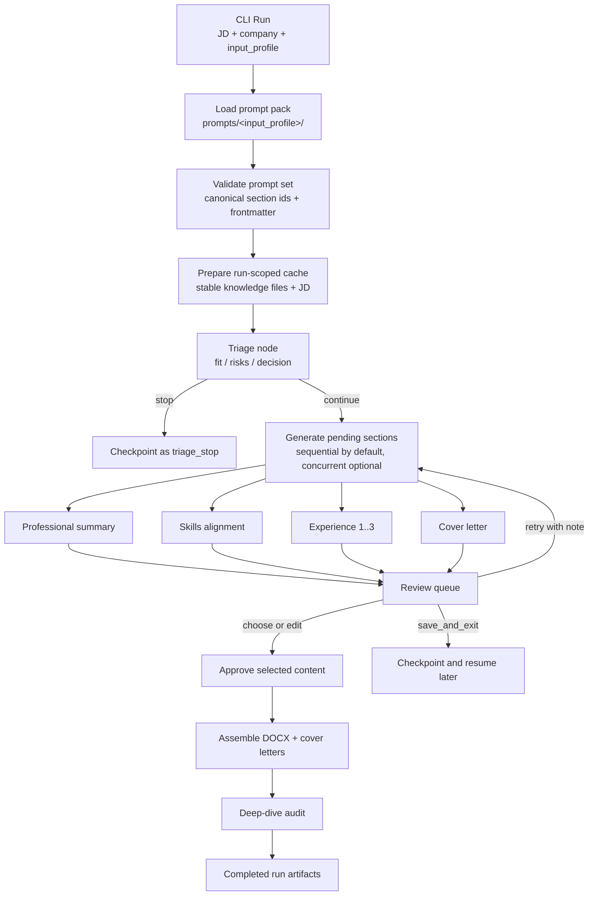

<a name="readme-top"></a>

<div align="center">
  <h2>🚀 AI Resume Tailor</h2>
  <p><b>A deterministic Python GenAI workflow for evidence-grounded resume tailoring and human-reviewed CV generation</b></p>

  <p align="center">
    <a href="https://github.com/your_username/ai-resume-tailor/issues">Report Bug</a>
    ·
    <a href="https://github.com/your_username/ai-resume-tailor/issues">Request Feature</a>
  </p>

  <p>
    
    
    
    
    
  </p>

  <p><b>Designed to work within Gemini free-tier limits</b> · Role-aware prompt packs · Checkpointed runs · Structured LLM outputs · Human review gates</p>
</div>

---

## 📖 The Problem & The Solution

**The Problem:** Resume tailoring is repetitive, easy to get wrong, and one-shot LLM rewrites often miss role-specific language or overstate experience.

**The Solution:** `AI Resume Tailor` treats resume tailoring as a controlled workflow rather than a one-shot prompt. It combines explicit graph routing, role-aware prompt packs, prompt-declared knowledge dependencies, structured Gemini outputs, resumable checkpoints, and human review gates to keep generation traceable, grounded, and easy to correct.

---

## ✨ Key Features

* **🎯 Evidence-Grounded Tailoring:** Resume sections are rewritten against the target role without inventing experience, using role-specific accomplishments, skills matrices, and writing rules.
* **🧭 Deterministic Workflow Graph:** Triage, generation, review, assembly, and audit are explicit nodes with predictable transitions and targeted regeneration.
* **📦 Role-Aware Prompt Packs:** `input_profile` selects the active `prompts/<profile>/`, `knowledge/<profile>/`, offline fixtures, and DOCX template.
* **📚 Scoped Context Contracts:** Prompt frontmatter declares exact `knowledge_files` per section instead of loading the whole knowledge base.
* **♻️ Run-Scoped Gemini Cached Content:** Stable knowledge files plus the run's JD are uploaded once and reused across section generation for lower token churn.
* **🛑 Human Approval Gates:** Review supports `choose`, `edit`, `retry`, and `save_and_exit` before final export.
* **🔌 Structured LLM Layer:** Gemini calls are centralized and validated through strict JSON or Markdown output contracts.
* **💾 Resumable Run Artifacts:** Checkpoints, logs, outputs, and the source JD are persisted under `runs/`.

---

## 🧠 System Architecture

This project does not rely on a generic agent framework. It models the workflow directly in Python as a small, explicit state machine with checkpointed state, role-aware prompt resolution, and deterministic node routing.

That design is the point: the interesting part is not "LLM + prompts", but a controlled GenAI pipeline with:

* explicit graph nodes and checkpointed `GraphState`
* `input_profile`-based prompt and knowledge packs
* prompt-declared evidence files per section
* run-scoped Gemini cached content reused across section generation
* strict machine-checked response contracts
* human review before final assembly

### Runtime Flow



### Prompt-Knowledge Network (`input_profile=role_engineer`)

Automatic generation runs first by default to save time. Human review comes after generation as a correction gate for selection, edits, or targeted retries.

The prompt network below is intentionally collapsed because it is a deeper architecture view rather than the first-read workflow diagram.

```mermaid
flowchart TD
    subgraph INPUTS["Run Inputs"]
        JD["job_description.md"]
        PROFILE["input_profile = role_engineer"]
    end

    subgraph KNOWLEDGE["Knowledge Layer"]
        KM["profile_technical_skills_matrix.md"]
        A1["accomplishments_work_1_older.md"]
        A2["accomplishments_work_2_previous.md"]
        A3["accomplishments_work_3_latest.md"]
        RS["rules_professional_summary.md"]
        RB["rules_bullet_points_formatting.md"]
        RC["rules_cover_letter_playbook.md"]
        CL["constraints_legal_and_location_blockers.md"]
    end

    subgraph PROMPTS["Prompt Layer"]
        TRIAGE["triage_job_fit_and_risks"]
        SUMMARY["section_professional_summary"]
        SKILLS["section_skills_alignment"]
        EXP1["section_experience_1"]
        EXP2["section_experience_2"]
        EXP3["section_experience_3"]
        COVER["doc_cover_letter"]
    end

    subgraph EXECUTION["Execution Layer"]
        CACHE["run-scoped cached content"]
        GEN["automatic generation<br/>default path"]
        REVIEW["review / retry / edit"]
        OUT["DOCX assembly + audit outputs"]
    end

    PROFILE --> TRIAGE
    PROFILE --> SUMMARY
    PROFILE --> SKILLS
    PROFILE --> EXP1
    PROFILE --> EXP2
    PROFILE --> EXP3
    PROFILE --> COVER

    JD --> TRIAGE
    JD --> SUMMARY
    JD --> SKILLS
    JD --> EXP1
    JD --> EXP2
    JD --> EXP3
    JD --> COVER

    KM --> TRIAGE
    KM --> SUMMARY
    KM --> SKILLS
    KM --> EXP1
    KM --> EXP2
    KM --> EXP3
    KM --> COVER

    CL --> TRIAGE
    RS --> SUMMARY
    RB --> EXP1
    RB --> EXP2
    RB --> EXP3
    RC --> COVER
    A1 --> SUMMARY
    A1 --> EXP1
    A1 --> COVER
    A2 --> SUMMARY
    A2 --> EXP2
    A2 --> COVER
    A3 --> SUMMARY
    A3 --> EXP3
    A3 --> COVER

    TRIAGE --> CACHE
    SUMMARY --> CACHE
    SKILLS --> CACHE
    EXP1 --> CACHE
    EXP2 --> CACHE
    EXP3 --> CACHE
    COVER --> CACHE

    CACHE --> GEN
    GEN --> REVIEW
    REVIEW --> OUT
```

<details>
  <summary><b>Open prompt-to-knowledge dependency diagram</b></summary>



</details>

This view shows the dependency shape that matters operationally:

* prompts do not consume the full knowledge directory blindly
* shared truth sources such as the skills matrix are reused across multiple prompts
* accomplishment files are routed only to the sections they can credibly support
* writing-rule files shape output differently for summary, bullets, and cover letter generation

### 📐 Architecture Decision Records (ADRs)

1. **Why a Custom State Machine over LangChain?** For a strictly scoped CLI tool, a plain Python state machine is easier to read, easier to test, and harder to over-engineer.
2. **Context Isolation via Frontmatter:** To reduce hallucination risk and avoid context bloat, prompts do not read the entire knowledge base blindly. Markdown prompts request only the specific files they need.
3. **Cache Reuse over Prompt Bloat:** Stable knowledge files are fingerprinted and reused through Gemini cached content, while the job description remains run-scoped.
4. **Human Review over Autonomous Rewrite Loops:** The tool optimizes for operator control and targeted retries, not self-directed regeneration chains.


---

## 🗺️ Roadmap (V2 Enhancements)

V1 focuses on delivering a deterministic, lightweight State Machine. Once the core pipeline is locked, the following architectural upgrades are planned:

* **Multi-Agent Evaluator (LLM-as-a-Judge):** Add one critic node before human review if V1 proves the core workflow first.
* **Alternative Local-Provider Path:** Add **Ollama / vLLM** after the Gemini-only V1 flow is stable.
* **Retrieval-Augmented Context Selection:** Move from static YAML frontmatter toward retrieval-driven context injection when the current workflow is stable.

---

## ✅ V1 Implementation Snapshot (Current)

To complement the vision above, the current shipped V1 behavior is strict and deterministic:

* **Canonical workflow IDs:** `triage_job_fit_and_risks`, `section_professional_summary`, `section_skills_alignment`, `section_experience_1..3`, `doc_cover_letter`, `audit_cv_deep_dive`
* **Single checkpoint contract:** `GraphState` persisted with versioned state for pause/resume consistency
* **Role-aware runtime resolution:** prompts, knowledge, offline fixtures, and default template are selected from `input_profile`
* **Strict AI response contracts:** JSON envelopes for triage and generation; Markdown contract for the audit report
* **Review actions:** per section `choose | edit | retry`, plus global `save_and_exit`
* **Generation controls:** sequential by default, concurrent optional, with pacing and 429 backoff
* **Prompt/template safety rules:** canonical section normalization, duplicate ID detection, and fail-fast validation
* **Run outputs:** `tailored_cv.docx`, `cover_letters.md`, `cv_deep_dive_audit.md`, `job_description.md`, checkpoint + metadata + logs under `runs/...`

## 🤖 Why It Is Interesting for GenAI Engineering

* **Structured generation contracts:** Prompts return machine-readable outputs that can be parsed, validated, and retried with bounded logic.
* **Role-aware context selection:** `input_profile` lets the same workflow operate over different prompt and knowledge packs.
* **Scoped evidence loading:** Section prompts declare their own knowledge dependencies instead of relying on a monolithic prompt context.
* **Cache-aware LLM integration:** Stable knowledge and the run JD are prepared once, then reused through Gemini cached content across node execution.
* **Human review gates over autonomous loops:** Review happens before final output, keeping control with the operator.
* **Deterministic offline validation:** Offline fixtures make it possible to exercise the workflow without live API calls.

Current CLI commands:

```sh
python main.py run --jd-path ./inputs/job_description.md --company "Stripe"
python main.py run --jd-path ./inputs/job_description.md --company "Stripe" --job-title "Senior Backend Engineer"
python main.py resume --run-path ./runs/stripe
# or
python main.py resume --checkpoint-path ./runs/stripe/state_checkpoint.json
python main.py status --run-path ./runs/stripe
python main.py regenerate --run-path ./runs/stripe --sections section_professional_summary --note "make outcomes more specific"
python main.py rebuild-output --run-path ./runs/stripe
```

---

## 🚀 Getting Started

<p><b>New here?</b> Use the concise setup guide: <a href="./RUNBOOK_SETUP.md">RUNBOOK_SETUP.md</a></p>

### Prerequisites

* Python 3.10+
* A Google Gemini API key

### Installation

1. Clone the repo
```sh
git clone [https://github.com/your_username/ai-resume-tailor.git](https://github.com/your_username/ai-resume-tailor.git)

```


2. Set up a virtual environment
```sh
python -m venv .venv
source .venv/bin/activate  # Windows: .venv\Scripts\activate

```


3. Install dependencies
```sh
pip install -r requirements.txt

```


4. Set your environment variables
```env
# .env
GEMINI_API_KEY=your_api_key_here

```


---

## 💻 Usage

**1. Start a New Tailoring Session:**

```sh
python main.py run --jd-path ./inputs/job_description.md --company "Stripe"
python main.py run --jd-path ./inputs/job_description.md --company "Stripe" --job-title "Senior Backend Engineer"

```

`--jd-path` accepts `.txt` or `.md`. Each run stores the supplied text as `runs/<run_id>/job_description.md` and uploads that file fresh for the run-scoped cached content.

### One-Command Runner (Windows PowerShell)

If you do not want to type API key / JD path / company each run:

1. Copy `secrets\gemini_api_key.example.txt` to `secrets\gemini_api_key.txt`.
2. Put your key inside `secrets\gemini_api_key.txt` (gitignored).
3. Edit `tools\RUNNER.config.ps1` once (`JobDescriptionPath`, `CompanyName`, optional `JobTitle`, optional `OutputCvFileName`, optional `ModelName`).
4. Run:

```powershell
.\tools\run_local.ps1
```

If `OutputCvFileName` is empty, the runner derives it automatically as `CompanyName - JobTitle.docx` or `CompanyName.docx` when `JobTitle` is blank.

### Offline Smoke Run (No Network)

Use deterministic local fixtures to validate end-to-end behavior (logs, checkpoint, DOCX output):

```powershell
$env:ART_OFFLINE_MODE="1"
$env:ART_AUTO_APPROVE_REVIEW="1"
python main.py run --jd-path .\inputs\job_description.md --company "Offline Smoke"
```

Default offline fixture file:

- `offline_fixtures/<role>/offline_responses.example.json`

Optional custom fixture path:

```powershell
$env:ART_OFFLINE_FIXTURES_PATH="C:\path\to\fixtures.json"
```

### Real Gemini Run (Google AI Studio)

```powershell
$env:GEMINI_API_KEY="your_api_key_here"
Remove-Item Env:ART_OFFLINE_MODE -ErrorAction SilentlyContinue
Remove-Item Env:ART_AUTO_APPROVE_REVIEW -ErrorAction SilentlyContinue
python main.py run --jd-path .\inputs\job_description.md --company "Stripe"
```

Model can be changed locally via:

- `tools\RUNNER.config.ps1` (`ModelName`)
- CLI: `--model`
- env: `$env:GEMINI_MODEL="..."`
- code default: `DEFAULT_GEMINI_MODEL` in `settings.py`

### Throughput Tuning

Defaults are now safer for free tier (sequential + pacing + 429 backoff).  
You can tune with env vars:

```powershell
$env:ART_GENERATION_MODE="sequential"   # or "concurrent"
$env:ART_LLM_MIN_INTERVAL_SECONDS="12"  # lower for higher throughput
$env:ART_LLM_MAX_429_ATTEMPTS="5"
$env:ART_LLM_BACKOFF_BASE_SECONDS="2"
```

### Pytest Pacing Defaults (Fast by Default)

`pytest` runs now default to:

- `ART_LLM_MIN_INTERVAL_SECONDS=0`

This keeps local and CI tests fast for mocked/offline flows.

For real Gemini end-to-end tests on free tier, use:

- pytest marker: `@pytest.mark.real_gemini_e2e`

That marker automatically restores pacing to:

- `ART_LLM_MIN_INTERVAL_SECONDS=12`

**2. Resume a Paused Review Session (from JSON Checkpoint):**

```sh
python main.py resume --run-path ./runs/stripe
# or
python main.py resume --checkpoint-path ./runs/stripe/state_checkpoint.json

```

**3. End-to-end flow (triage -> auto generation -> status -> targeted regenerate -> rebuild):**

```sh
# Start run and make triage decision in CLI (continue_anyway/stop)
python main.py run --jd-path ./inputs/job_description.md --company "Stripe"

# Optional: force non-interactive smoke path for triage + review
# ART_TRIAGE_DECISION_MODE=always_continue ART_AUTO_APPROVE_REVIEW=1 python main.py run --jd-path ./inputs/job_description.md --company "Stripe"

# Review current checkpoint state
python main.py status --run-path ./runs/stripe

# Regenerate only specific sections with explicit reviewer note
python main.py regenerate --run-path ./runs/stripe --sections section_professional_summary,doc_cover_letter --note "focus on measurable impact"

# Rebuild final outputs from approved content
python main.py rebuild-output --run-path ./runs/stripe
```

Run folders are now reused by company slug (`runs/<company-slug>`). If you pass `--job-title`, the run folder becomes `runs/<company_slug>_<job_title_slug>`.  
If you want separate runs for multiple roles at one company, use `--job-title` (for example `runs/stripe_senior_backend_engineer`).

*(Optional: Insert a `.gif` here showing your CLI menu in action. Hiring managers love seeing the tool actually working in a terminal).*

---

## 🛡️ Privacy & Security

Knowledge files and run artifacts stay in repo-local directories. During live generation, only scoped prompt context is sent to the Gemini API; outputs, checkpoints, and logs remain under `runs/`.

---

## 📄 License

Distributed under the MIT License. See `LICENSE` for more information.


